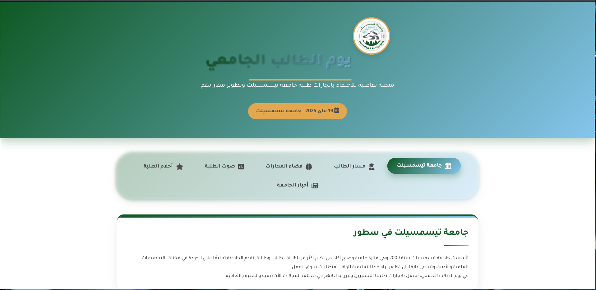

# 🎓 Student Day - University of Tissemsilt | يوم الطالب الجامعي



## 📌 About the Project | حول المشروع

**Student Day - Tissemsilt University** is a commemorative interactive web platform developed for the celebration of **Student Day** on **May 19, 2025**, at the University of Tissemsilt. It was proudly presented in the presence of the **Governor of Tissemsilt**.

تم تطوير هذا الموقع التفاعلي خصيصًا لإحياء فعاليات **يوم الطالب الجامعي** المصادف لـ **19 ماي 2025** بجامعة تيسمسيلت، وقد تم عرضه رسميًا أمام **والي ولاية تيسمسيلت**.

---

## 🌟 Features | المميزات

- Tabs for student journey, skills, dreams, and university stats  
  تبويبات تعرض مسار الطالب، فضاء المهارات، الأحلام، وإحصائيات الجامعة
- Interactive poll system and suggestion form  
  نظام تصويت تفاعلي ونموذج لاقتراحات الطلبة
- Fully responsive and RTL Arabic support  
  متجاوب كليًا ويدعم اللغة العربية (من اليمين إلى اليسار)
- Built with HTML, CSS, JavaScript (No frameworks)  
  تم تطويره باستخدام HTML وCSS وJavaScript فقط بدون أطر عمل

---

## 🏗️ Project Structure | هيكل المشروع

```
.
├── index.html                # Main HTML file | الملف الرئيسي
└── static
    ├── css
    │   └── style.css         # Styles | التنسيقات
    ├── js
    │   └── script.js         # Interactivity | السكربتات التفاعلية
    └── images
        └── home.png          # Screenshot for README | لقطة شاشة للعرض
```

---

## 📷 Screenshot | لقطة شاشة


---

## 🛠️ Technologies Used | التكنولوجيات المستعملة

- HTML5
- CSS3
- JavaScript (Vanilla)
- Chart.js for polls
- FontAwesome for icons

---

## 🔗 Live Demo | المعاينة الحية

👉 [Visit the Website](https://student-day-tissemsilt.onrender.com)

---

## 👨‍💻 Author | المطور

Developed by **Achref** – Frontend developer & student at Tissemsilt University  
تم تطويره من طرف **أشرف** – مطور واجهات طالب بجامعة تيسمسيلت

---

## 📜 License | الرخصة

This project is for educational and institutional use only.  
هذا المشروع موجه لأغراض تعليمية وأكاديمية فقط.
